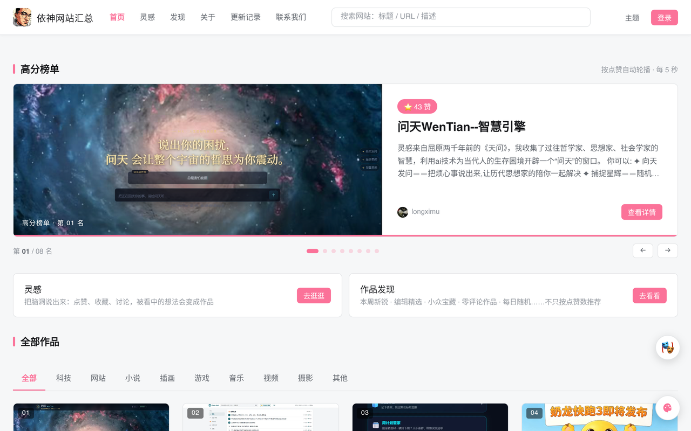
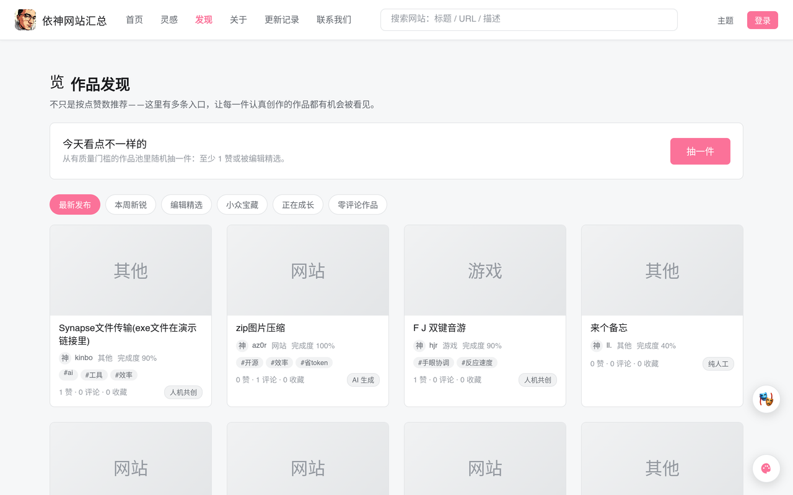
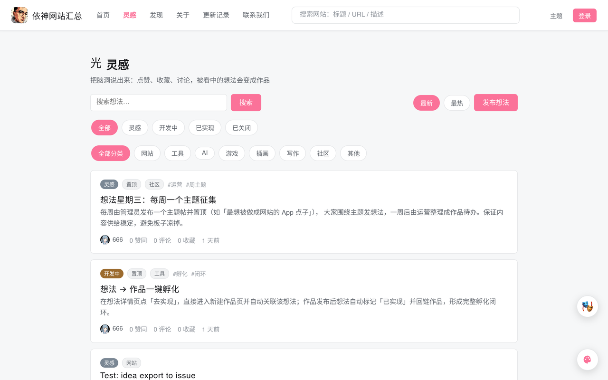
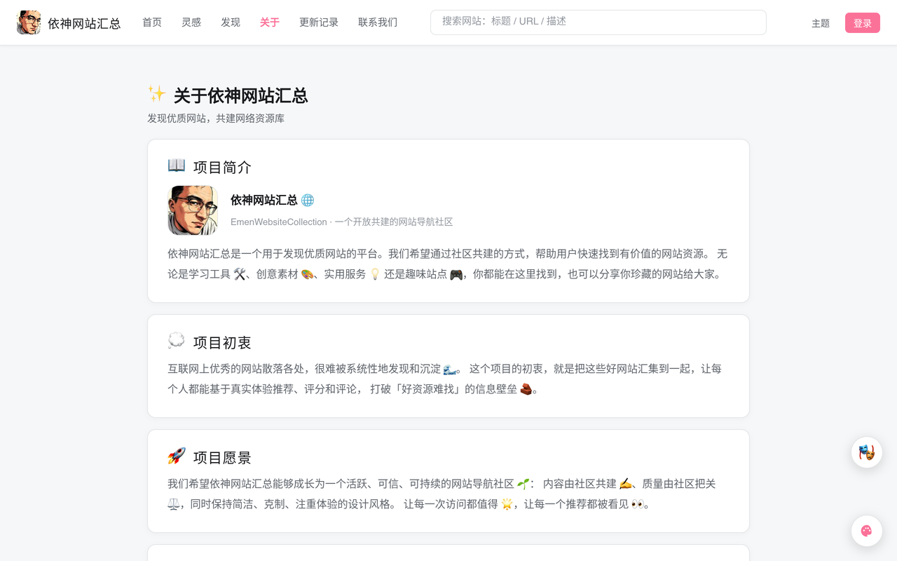
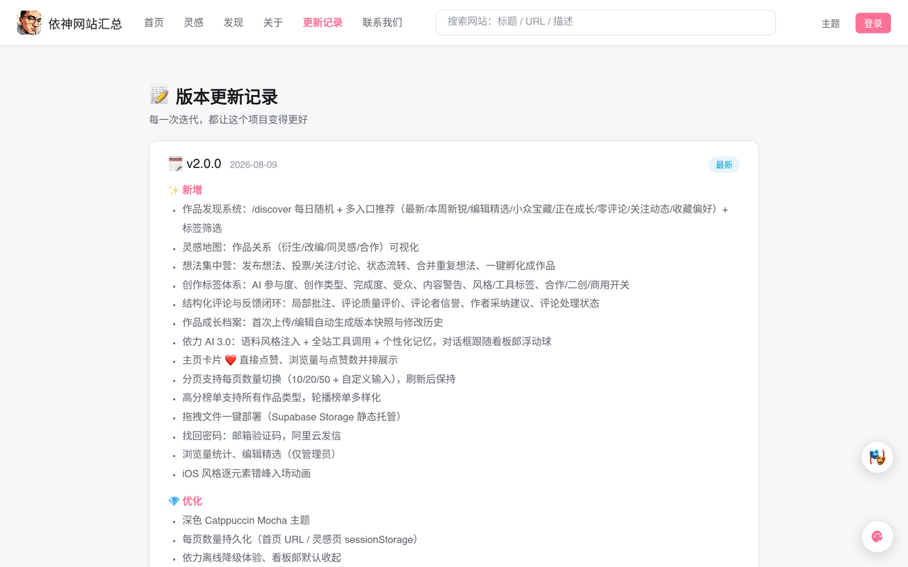
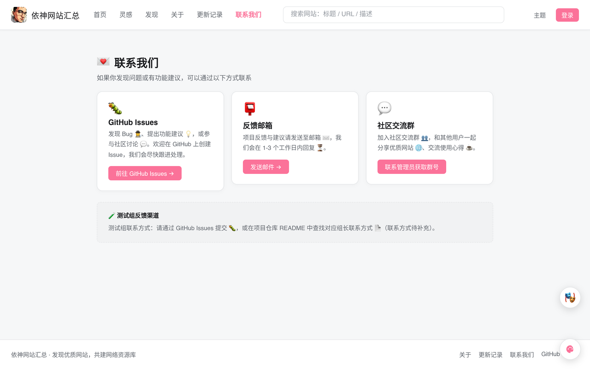
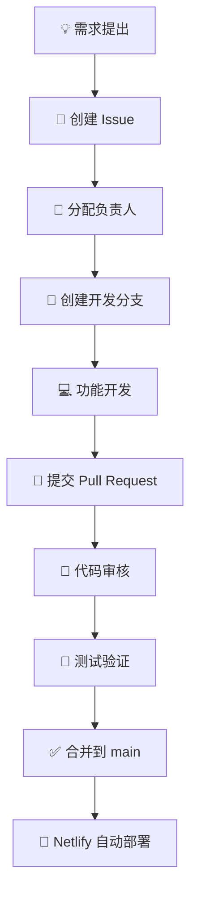

<!-- 顶部：项目名 + 徽章（占位，可按需替换） -->

  

<h1 align="center">🚀 依神网站汇总</h1>

  
  
  
  

---

## ✨ 网站功能介绍

> 依神网站汇总是一个**开放共建的网站导航社区** 🌐：不止收录网站，更把「小说、插画、游戏、音乐、视频、摄影」等各类作品聚合到一个平台，让每一份认真创作都能被看见 👀。

### 🗂️ 核心功能总览

| 功能模块   | 图标 | 一句话说明                                       | 主要入口        |
| ---------- | ---- | ------------------------------------------------ | --------------- |
| 作品浏览   | 🏠   | B 站风格卡片信息流，高分轮播 + 分区 Tab + 搜索   | `/`             |
| 作品发现   | 🧭   | 8 条推荐入口 + 每日随机抽取 + 标签筛选           | `/discover`     |
| 想法集中营 | 💡   | 发布灵感、投票讨论、状态流转、一键孵化成作品     | `/ideas`        |
| 作品详情   | 📄   | 点赞 / 收藏 / 浏览统计、关注作者、深度评论与批注 | `/website/:id`  |
| 灵感地图   | 🗺️   | 作品关系可视化（衍生 / 改编 / 合作 / 同灵感）    | `/work/:id/map` |
| 创作者主页 | 👤   | 个人资料、作品集与关注动态                       | `/user/:id`     |
| AI 助手    | 🤖   | 看板郎「依力」站内陪聊 + 工具调用 + 个性化记忆   | 右下角悬浮球    |
| 主题系统   | 🎨   | 7 套内置主题 + 自定义强调色 / 背景图             | 导航栏「主题」  |
| 账号系统   | 🔐   | 用户名登录、个人中心、头像、找回密码             | `/profile`      |
| 部署与运营 | 🚀   | 拖拽一键部署、编辑精选、分区管理（仅管理员）     | —               |

### 🏠 首页 · 作品浏览

打开首页即可浏览全站作品：顶部是 **高分榜单轮播** 🏆，下方是**可配置的分区 Tab**（网站、小说、插画、游戏……），主体为 B 站式卡片信息流，卡片直接展示封面、浏览量、点赞数与作者头像，支持**搜索**、**点赞**和**每页数量切换**。

### 🧭 作品发现

「发现」页不只看点赞数——提供 **8 条推荐入口**：最新发布、本周新锐、编辑精选、小众宝藏、正在成长、零评论作品、关注动态、收藏偏好，并支持 **每日随机抽一件**（有质量门槛）与**标签筛选**，让每件认真创作的作品都有机会被看见 ✨。

### 💡 想法集中营

把脑洞说出来：发布想法、点赞收藏、讨论，想法支持 **投票 / 关注 / 状态流转 / 合并重复**，被看中的想法可以直接 **孵化成作品**（详情页会标注「💡 孵化自想法」）。

### 💬 深度评论与反馈闭环

作品详情页支持完整的创作交流闭环：

- 🔹 **树形评论**：无限深度回复，@ 提及对方
- 📍 **局部批注**：图片区域 📷、文本选中 📝、视频 / 音频时间区间 🎬、组件路径 🧩
- 💯 **评论质量评价**：「有用 / 精辟 / 存疑」等标签投票
- ✅ **作者采纳**：采纳建议并记录进作品成长档案
- 🏷️ **处理状态**：开放 / 处理中 / 已解决 / 忽略

### 🏷️ 创作标签体系

每个作品都可以打上丰富的创作标签：**AI 参与度** 🤖（合规标识）、**创作类型**（原创 / 二创 / 合作 / 委托 / 练习）、**完成度**、**受众**、**内容警告** ⚠️、**风格 / 工具**，以及 **合作 / 二创 / 商用** 开关。

### 🗺️ 灵感地图

以作品为中心的创作关系节点图：显式关系（衍生 / 改编 / 同灵感 / 合作）+ 基于标签、风格、工具重叠的自动相似边。

### 🤖 AI 助手「依力」

站内看板郎助手：**语料风格注入 + 全站工具调用 + 个性化记忆**，对话框跟随看板郎浮动球；离线时自动降级，保证体验不中断。

### 🎨 多主题切换

| 主题        | 明暗    | 说明                   |
| ----------- | ------- | ---------------------- |
| 依神默认    | ☀️ 浅色 | 品牌粉色系             |
| Catppuccin  | 🌙 暗色 | Mocha 经典配色         |
| Tokyo Night | 🌙 暗色 | 紫蓝夜配色             |
| One Dark    | 🌙 暗色 | Atom 经典              |
| Dracula     | 🌙 暗色 | 经典吸血鬼配色         |
| Mac OS | ☀️ 浅色 | 果味浅色，液态玻璃质感 |
| Mac OS 暗色 | 🌙 暗色 | 深色系统风，暗色毛玻璃 |
| 自定义      | 🎨      | 自定义强调色与背景图   |

### 📄 更多页面

| 关于                                | 更新记录                                    | 联系我们                                  |
| ----------------------------------- | ------------------------------------------- | ----------------------------------------- |
|  |  |  |

### 🔑 角色与权限

| 角色     | 图标 | 能力                                         |
| -------- | ---- | -------------------------------------------- |
| 游客     | 👀   | 浏览、搜索、查看详情与评论                   |
| 登录用户 | 🧑‍💻   | 点赞、收藏、评论、投稿、关注创作者、发布想法 |
| 创作者   | 🎨   | 管理自己的作品、采纳建议、标记反馈处理状态   |
| 管理员   | 🛡️   | 编辑精选、分区管理、内容审核                 |

### 🧩 支持的作品类型

| 类型 | 图标 | 类型 | 图标 |
| ---- | ---- | ---- | ---- |
| 网站 | 🌐   | 音乐 | 🎵   |
| 小说 | 📖   | 视频 | 🎬   |
| 插画 | 🎨   | 摄影 | 📷   |
| 游戏 | 🎮   | 其他 | ✨   |

---

## 📖 目录

- [✨ 网站功能介绍](#-网站功能介绍)
- [🧩 团队分组与职责](#-团队分组与职责)
- [🔄 协作开发流程](#-协作开发流程)
- [🛠 技术栈](#-技术栈)
- [📌 注意事项](#-注意事项)
- [💬 沟通与支持](#-沟通与支持)

---

## 🧩 团队分组与职责

| 分组                  | 核心职责                 | 主要工作内容                                                                                                                    | 负责模块/区域                                      |
| --------------------- | ------------------------ | ------------------------------------------------------------------------------------------------------------------------------- | -------------------------------------------------- |
| **📋 项目管理组**     | 项目整体规划与协调       | 制定发展方向与技术路线；创建、分配、跟进 Issue；审核 Pull Request；管理 GitHub 仓库；维护文档与开发规范；负责核心架构与重大决策 | 全局                                               |
| **🎨 前端 UI/UX 组**  | 界面设计与交互体验       | 页面布局设计与优化；UI 样式开发；响应式适配（PC/移动端）；动画与交互优化；组件封装与复用                                        | `src/pages` `src/components` `src/styles`    |
| **⚙️ 功能开发组**     | 核心业务功能开发         | 新功能设计实现；用户交互逻辑开发；功能模块维护（如点赞、评论、搜索、分类、排序、分页等）                                        | `src/pages` `src/services` `src/hooks`       |
| **🗄️ 数据库与后端组** | 数据管理、权限控制与安全 | Supabase 数据库设计；数据表创建与维护；SQL 编写；RLS 权限策略管理；用户权限维护；数据安全检查；后端接口维护                     | Supabase Dashboard SQL Editor `src/services` |
| **🧪 测试与产品组**   | 功能测试与反馈           | 执行测试、记录 Bug；收集用户反馈；提出改进建议                                                                                  | 全流程                                             |

---

## 🔄 协作开发流程

我们使用 **GitHub Flow** 变体，所有功能必须遵循以下标准化流程：

> 💡 **分支命名规范**：`feat/xxx`（新功能）或 `fix/xxx`（Bug 修复）  
> 🔗 **关联 Issue**：PR 描述中请使用 `Closes #issue-number` 自动关联

---

## 🛠 技术栈

- **前端框架**：React 18 + Vite 5（SPA）
- **样式方案**：全局 CSS（`src/styles/`：tokens.css / global.css / animations.css，CSS 变量主题体系）
- **后端服务**：Supabase（数据库、认证、存储），数据库迁移脚本见 `sql/` 目录（编号顺序执行）
- **部署平台**：Netlify（持续集成与自动部署）
- **版本控制**：Git + GitHub

---

## 📌 注意事项

- ✅ 所有 Issue 和 PR 必须使用英文或中文清晰描述，并关联对应的项目看板。
- ✅ 提交代码前请确保 `npm run build` 通过（项目暂未配置 ESLint/Prettier 与自动化测试）。
- ✅ 数据库变更必须经过数据库组审核，并编写对应的迁移脚本。
- ✅ 任何架构层面的改动需提前在项目管理组发起讨论。

---

## 💬 沟通与支持

- 主要协作平台：**GitHub Issues & Pull Requests**
- 紧急问题：请联系对应组长（联系方式待补充）
- 欢迎所有贡献者！🎉
