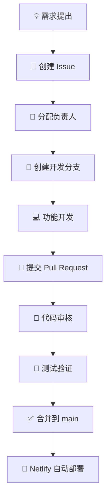

<!-- 顶部：项目名 + 徽章（占位，可按需替换） -->

  

<h1 align="center">🚀 依神网站汇总</h1>

  
  
  
  

---

## 📖 目录

- [团队分组与职责](#-团队分组与职责)
- [协作开发流程](#-协作开发流程)
- [技术栈](#-技术栈)
- [注意事项](#-注意事项)
- [沟通与支持](#-沟通与支持)

---

## 🧩 团队分组与职责

| 分组 | 核心职责 | 主要工作内容 | 负责模块/区域 |
|------|----------|--------------|---------------|
| **📋 项目管理组** | 项目整体规划与协调 | 制定发展方向与技术路线；创建、分配、跟进 Issue；审核 Pull Request；管理 GitHub 仓库；维护文档与开发规范；负责核心架构与重大决策 | 全局 |
| **🎨 前端 UI/UX 组** | 界面设计与交互体验 | 页面布局设计与优化；UI 样式开发；响应式适配（PC/移动端）；动画与交互优化；组件封装与复用 | `src/pages` `src/components` `src/styles` |
| **⚙️ 功能开发组** | 核心业务功能开发 | 新功能设计实现；用户交互逻辑开发；功能模块维护（如点赞、评论、搜索、分类、排序、分页等） | `src/pages` `src/services` `src/hooks` |
| **🗄️ 数据库与后端组** | 数据管理、权限控制与安全 | Supabase 数据库设计；数据表创建与维护；SQL 编写；RLS 权限策略管理；用户权限维护；数据安全检查；后端接口维护 | Supabase Dashboard SQL Editor `src/services` |
| **🧪 测试与产品组** | 功能测试与反馈 | 执行测试、记录 Bug；收集用户反馈；提出改进建议 | 全流程 |

---

## 🔄 协作开发流程

我们使用 **GitHub Flow** 变体，所有功能必须遵循以下标准化流程：

> 💡 **分支命名规范**：`feat/xxx`（新功能）或 `fix/xxx`（Bug 修复）  
> 🔗 **关联 Issue**：PR 描述中请使用 `Closes #issue-number` 自动关联

---

## 🛠 技术栈

- **前端框架**：React（待补充版本）
- **样式方案**：CSS Modules / Styled Components
- **后端服务**：Supabase（数据库、认证、存储）
- **部署平台**：Netlify（持续集成与自动部署）
- **版本控制**：Git + GitHub

---

## 📌 注意事项

- ✅ 所有 Issue 和 PR 必须使用英文或中文清晰描述，并关联对应的项目看板。
- ✅ 提交代码前请确保本地测试通过，并遵循项目的 ESLint/Prettier 配置。
- ✅ 数据库变更必须经过数据库组审核，并编写对应的迁移脚本。
- ✅ 任何架构层面的改动需提前在项目管理组发起讨论。
- 🔑 **找回密码**：登录页已支持通过「邮箱验证码」找回密码（详见 [docs/password-recovery.md](docs/password-recovery.md)）。手机号验证码暂未上线（弹窗内显示「部署中」）。
  - 实现方式：前端调用 Netlify 函数（`/.netlify/functions/send-reset-code`、`reset-password`），由函数经 **Resend** 发信、用 Supabase `service_role` 重置密码——**不依赖 Supabase SMTP**。
  - 部署时需在 Netlify 配置环境变量：`RESEND_API_KEY`、`RESEND_FROM`、`SUPABASE_URL`、`SUPABASE_SERVICE_ROLE_KEY`（详见文档）。
  - 仅对注册时绑定了**真实邮箱**的账号生效；旧的 `username@nav.local` 假邮箱账号无法找回。

---

## 💬 沟通与支持

- 主要协作平台：**GitHub Issues & Pull Requests**
- 紧急问题：请联系对应组长（联系方式待补充）
- 欢迎所有贡献者！🎉
